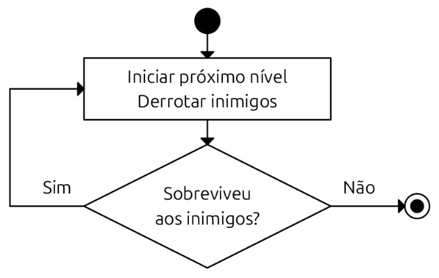

## One page game design document

Jeasiel Abner Silva Maciel, Laysa Alves Protásio, Mariane de Melo Silva, Yuri Alves Batista

Em The Last Blue Bannerman, o jogador é o último vassalo do exército azul, que, exceto por ele, foi destruído pelo exército vermelho, e deve lutar contra os soldados de tal exército vermelho que lhe encurralaram em um bosque até que essa luta traga seu fim.

The Last Blue Bannerman é um jogo de ação desenvolvido para jogadores que buscam minimalismo e dificuldade.
O objetivo do jogador é eliminar o maior número de inimigos em uma partida.

O jogo é jogado em partidas. Quando a partida começa, o jogador surge no centro da arena. A partida é dividida em níveis. Durante cada nível, um número parcialmente aleatório de inimigos surgem em volta da arena e seguem e atacam o jogador. O jogador deve eliminar os inimigos. Quando não restam inimigos na arena, o nível termina, se dá um intervalo e o próximo nível começa. Quando o jogador é acertado por um ataque, ele morre e a partida termina.

Os diferenciais do jogo são seu deliberado minimalismo e simplicidade, incluindo nos controles, no combate, nos inimigos e na progressão.

A principal inspiração para o The Last Blue Bannerman é o jogo Hyper Light Drifter ([Hyper Light Drifter on Wikipedia](https://en.wikipedia.org/wiki/Hyper_Light_Drifter)).

## Créditos

|Crédito|Link|
|---|---|
|Versão final|[The Last Blue Bannerman on itch.io](https://capeudinho.itch.io/the-last-blue-bannerman)|
|Código fonte|[The Last Blue Bannerman on GitHub](https://github.com/Capeudinho/the-last-blue-bannerman)|
|Sprites|[Tiny Swords on itch.io](https://pixelfrog-assets.itch.io/tiny-swords)|
|Efietos sonoros|[Free Fantasy SFX Pack on itch.io](https://tommusic.itch.io/free-fantasy-200-sfx-pack)|
|Música|[FREE Music Loop Bundle on itch.io](https://tallbeard.itch.io/music-loop-bundle)|
|Fonte|[Alagard on DaFont](https://www.dafont.com/alagard.font)|

## Como executar

- Clonar repositório do GitHub.

- Abrir projeto com Godot Engine.

- Executar projeto.
